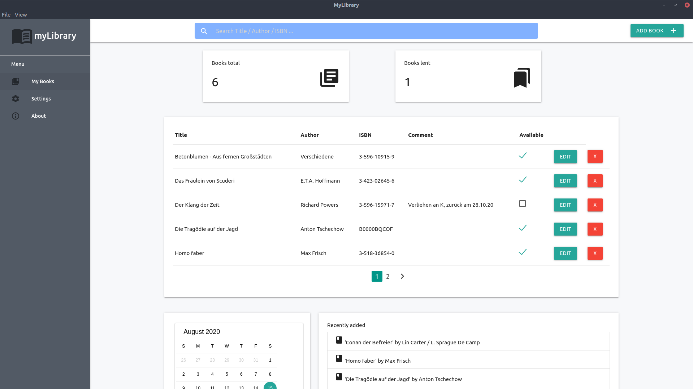

# myLibrary

## What is it?

I really love to collect and read books. Sometimes I lend them to friends and
often forget about them later on. That's where this piece of software comes into
play: My attempt on a program that focuses on just one simple thing- Keeping
track of my book collection!

## How?

Written in electron and plain javascript/HTML/CSS, after I saw [this video](https://www.youtube.com/watch?v=JaMCxVWtW58)
from Traversy Media.

## Warning!

This is still under development! :)
